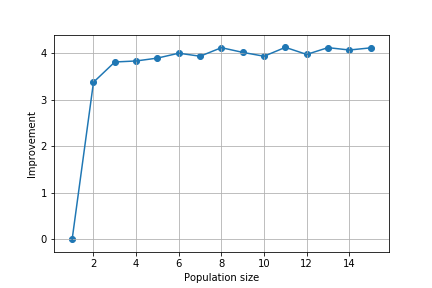

# CVRP-POP_VND
Capacitated vehicle routing problem solved using population based variable neighborhood descent.

## Short introduction
The main idea behing this project is to comapre the effectiveness of the basic VND and population based VND algorithm and not to produce the best solutions for the presented CVRP problem.
We used the Augerat 1995 P CVRP dataset available at [link](http://vrp.atd-lab.inf.puc-rio.br/index.php/en/)

## Strategies used
In our experiments we use the following neighborhoods: 
* merges two routes into one 
* swap stations between two routes
* move the station from one route to another
Note that after every change the route is re-optimized using a simple TSP solver.

In our experiments we use the following neighbor selection strategies:
* best improving neighbor
* random improving neighbor
* first improving neighbor

## Results
Through the experiments made in this project we show that using population based VND especially with neighborhood generation strategy shuffling can produce noticeably better results than just a basic implementation of VND. 

### Random strategy results (Hower to se the image title): 

 better/equal/worse than VND")

### First strategy results (Hower to se the image title): 

 better/equal/worse than VND")

### Best strategy results (Hower to se the image title): 

 better/equal/worse than VND")

#### Technical note
This project uses the [Heuristic-algorithms](https://github.com/pa1511/Heuristic-algorithms) project as the basis of its implementation. 
